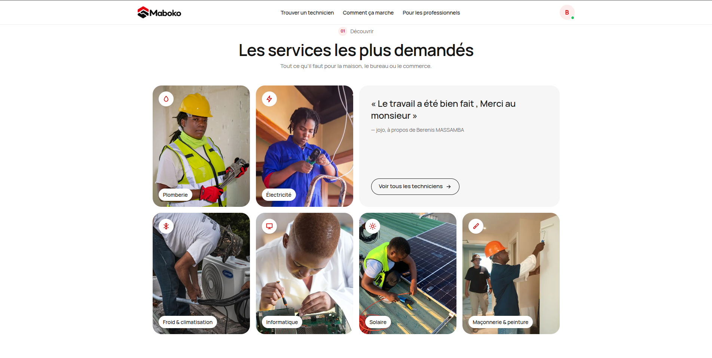
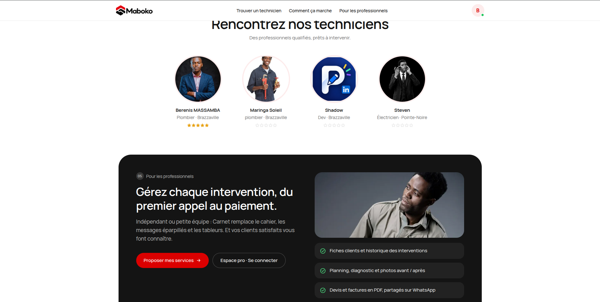
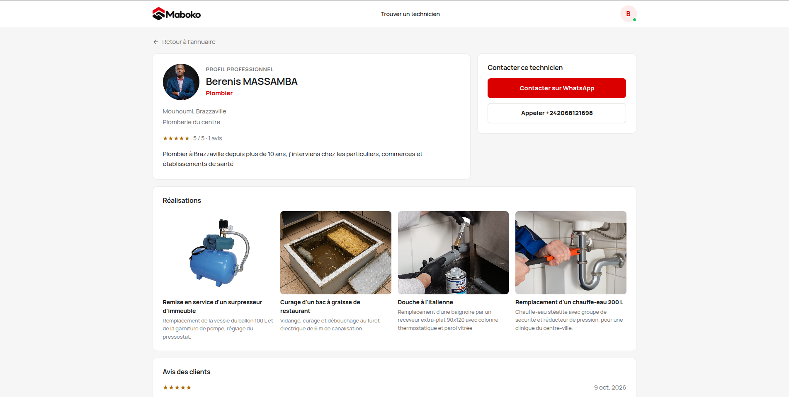
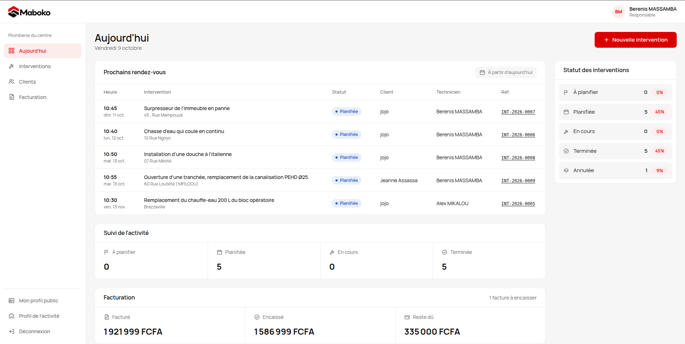
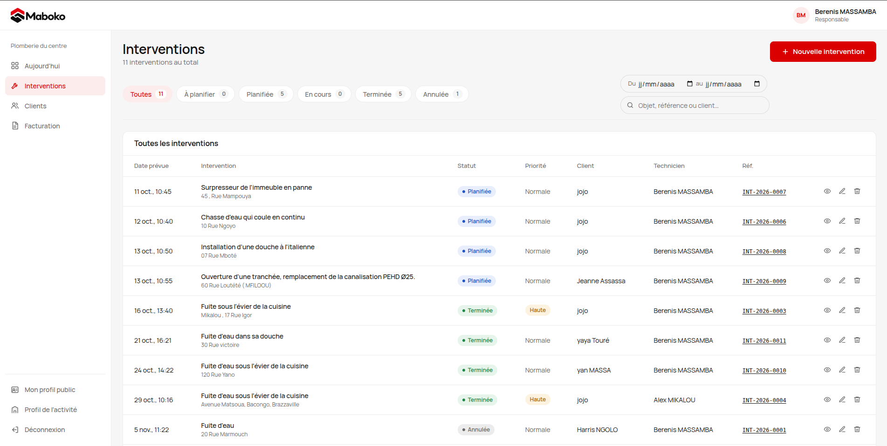
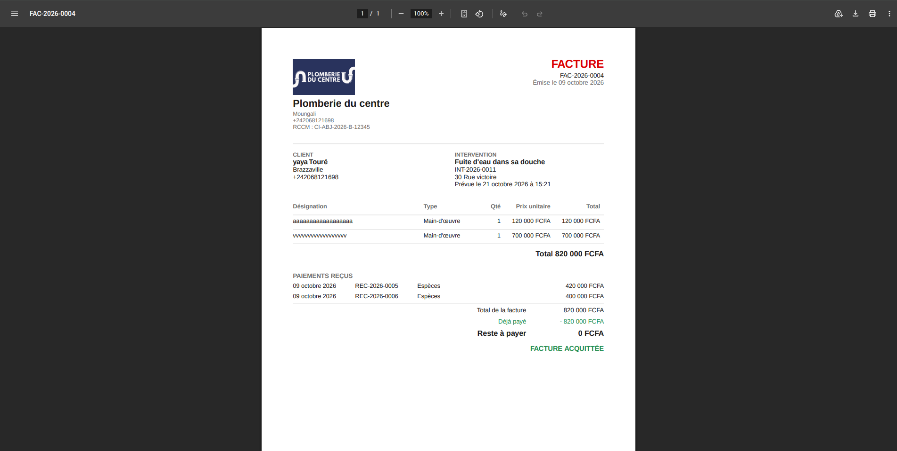
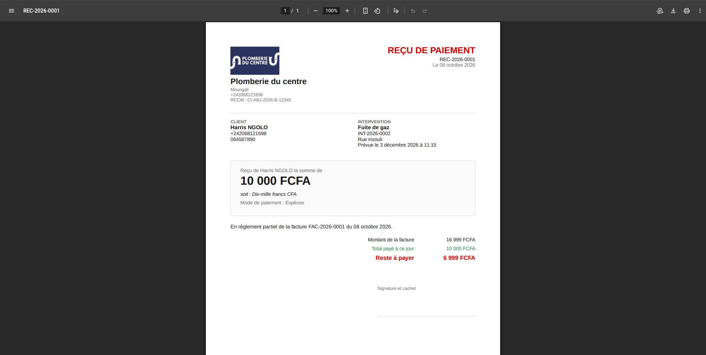

# Maboko — Carnet numérique des interventions

**Des techniciens de confiance, près de chez vous.**

Maboko est une application pensée pour les techniciens et artisans du Congo-Brazzaville (plomberie, électricité, froid, solaire, informatique, maçonnerie…). Elle réunit deux faces :

- **Pour les clients** : un annuaire public pour trouver un technicien par ville et par métier, consulter ses réalisations et ses avis, puis le contacter directement sur WhatsApp ou par téléphone.
- **Pour les professionnels** : un espace de gestion complet qui remplace le cahier, les messages éparpillés et les tableurs — clients, interventions, planning, devis, factures et reçus en PDF.


## Fonctionnalités

### Côté client

- Recherche de techniciens par service et par ville
- Profils publics avec réalisations en photos, note moyenne et avis vérifiés
- Contact direct sur WhatsApp ou par appel, sans intermédiaire
- Lien personnel envoyé après l'intervention pour noter le travail

| Services les plus demandés | Comment ça marche |
|---|---|
|  |  |

| Annuaire des techniciens | Profil public d'un technicien |
|---|---|
|  |  |

### Côté professionnel

- Tableau de bord du jour : prochains rendez-vous, statut des interventions, suivi de la facturation (facturé, encaissé, reste dû)
- Gestion des interventions : planification, priorité, technicien assigné, filtres par statut et par date, recherche
- Fiches clients et historique des interventions
- Facturation : factures et reçus de paiement générés en PDF, paiements partiels, montant en lettres
- Profil de l'activité (logo, RCCM, coordonnées) et profil public personnalisable





| Facture PDF | Reçu de paiement PDF |
|---|---|
|  |  |

## Stack

- Frontend : React, Vite, CSS
- Backend : Express, Prisma, PostgreSQL
- Fichiers : Cloudflare R2

## Structure

```
frontend/   application React
backend/    API Express et base de données
docs/       captures d'écran
```

## Prérequis

- Node.js 24
- PostgreSQL

## Installation

```bash
npm run install:all
```

Puis configurer le backend (voir `backend/README.md`) :

```bash
cd backend
cp .env.example .env
npm run db:migrate
npm run db:seed
```

## Lancer le projet

```bash
npm run dev
```

- Frontend : http://localhost:5173
- API : http://localhost:3000/api

## Conventions

- Une branche par tâche : `feature/<page>-<tache>`
- `npm run lint` dans `frontend/` avant chaque merge
